```{r setup, include=FALSE}
knitr::opts_chunk$set(echo = FALSE)
```

<style>
div.footnotes {
  position: absolute;
  bottom: 0;
  margin-bottom: 10px;
  width: 80%;
  font-size: 0.6em;
}
</style>

<script src="https://ajax.googleapis.com/ajax/libs/jquery/3.1.1/jquery.min.js"></script>

<script>
  $(document).ready(function() {
    $('slide:not(.backdrop):not(.title-slide)').append('<div class=\"footnotes\">');

    $('footnote').each(function(index) {
      var text  = $(this).html();
      var fnNum = (index+1).toString().sup();
      $(this).html(text + fnNum);

      var footnote   = fnNum + ': ' + $(this).attr('content') + '<br/>';
      var oldContent = $(this).parents('slide').children('div.footnotes').html();
      var newContent = oldContent + footnote;
      $(this).parents('slide').children('div.footnotes').html(newContent);
    });
  });
</script>

<style>
.small-code pre code {
  font-size: 1em;
}
</style>

## Presentation Objectives

* Provide example uses of R with **stormwater data**
* Opine on strengths, weaknesses; Share perspective

## My Background

* Staff in Municipal Stormwater Permitting Unit (i.e. the MS4 Unit)
* Some rudimentary background in coding
* Enjoy learning new things
* Appreciate when complex information is communicated elegantly and/or succintly 

## Disclaimer

* I am not an expert
* What I am presenting may be inefficient
* Tools, packages, and best practices evolve

## Background of R

- __Programming__ Language and Environment for Statistical Computing and Graphics
- __Open-source__
- Large ecosystem of freely available __packages__

# Analysis

## Analysis

- Renewing Phase I MS4 Permits -> "Regional MS4 Permit"
    + Evaluate monitoring data (~50 TMDLs) before permit consideration
    + Present our monitoring data analyses to the LA Regional Board in a series of 3 workshops (*did this earlier this year*)
    + Produce a monitoring data review report that goes over all the data (*working on finishing right now*)

## Example 1: Bacteria Data Review  

* **Several Bacteria TMDLs**
    + **Sites**: ~ 100 receiving water monitoring sites
    + **Water Type**: Marine or Fresh
    + **Beneficial Use**: REC-1, LREC-1, REC-2
    + **Frequency**: Typically Weekly
    + **Period**: 10 Years
    + **Parameters**: 4 Indicator Bacteria
    + **Limitations**: Daily and Geo Mean 

## Example 1: Bacteria Data Review
  
  $Estimate \approx (52 \ weeks)(10 \ years)(4 \ parameters)(100 \ sites)$ </br>
  $\approx \ 200,000 \ data \ points$ </br>
  $\approx \ 200,000 \ geometric \ means$ </br>
  $\approx \ 400,000 \ comparisons$

## Example 1: Bacteria Data Review
Excel VBA Tool:


## Example 1: Bacteria Data Review
### Excel VBA Tool
- Friendly User Interface
- Not Adaptable
- Slow
- Black Box
- Difficult to QA
- Difficult to Update

## Example 1: Bacteria Data Review

```{r bact_code, echo=TRUE, message=FALSE, warning=FALSE, eval=FALSE}
library(bacteria)

### Load and Clean Data Code

### Analyze Data
results <- bact_check(data, stations, "REC-1", "marine", 
                      sub_ecoli_for_fecal = TRUE, six_week = FALSE)
exceeds <- bact_ann_exceeds(data, stations, "REC-1", "marine", 
                            sub_ecoli_for_fecal = TRUE, six_week = FALSE)

### Plot Results Code

### Export Results Code
```

## Example 1: Bacteria Data Review
### R Bacteria Package
- Need to know R to use
- Adaptable
- Fast (seconds vs. minutes)
- Transparent -> Follow Analysis Step-by-Step
- Easier to QA / Unit Test
- Easy to Update

## Example 2: Bacteria Heatmap

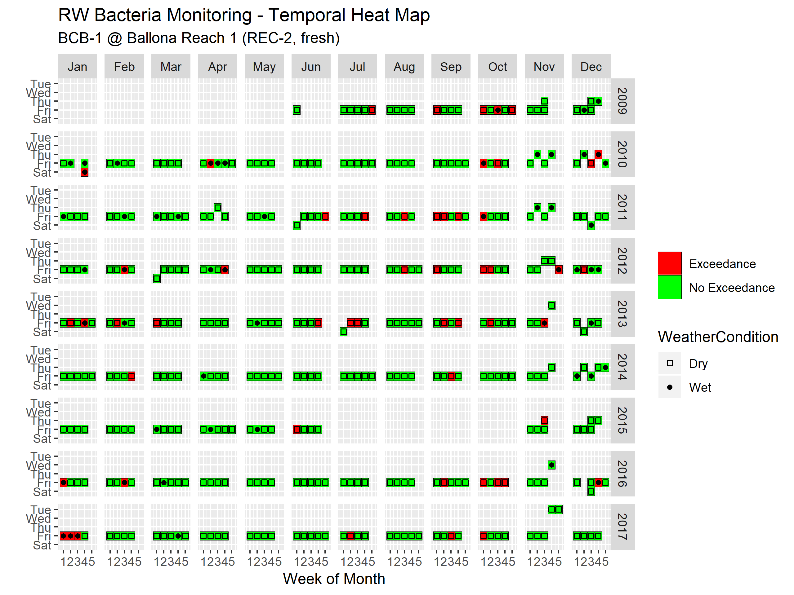

## Example 3: Exceedance Map

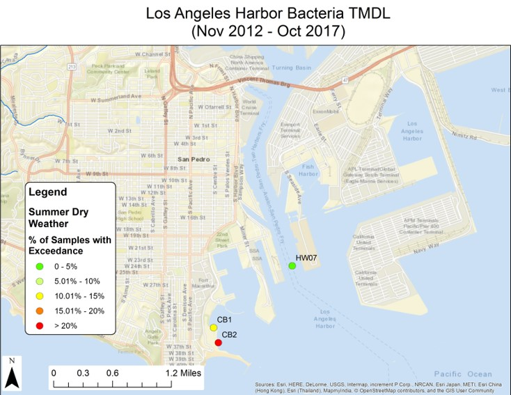

# Visualizations

## Visualizations
- ggplot2 package
- Standardize formatting
- Automate plotting for large datasets
- Replot when data updated

## Example 4: Boxplots

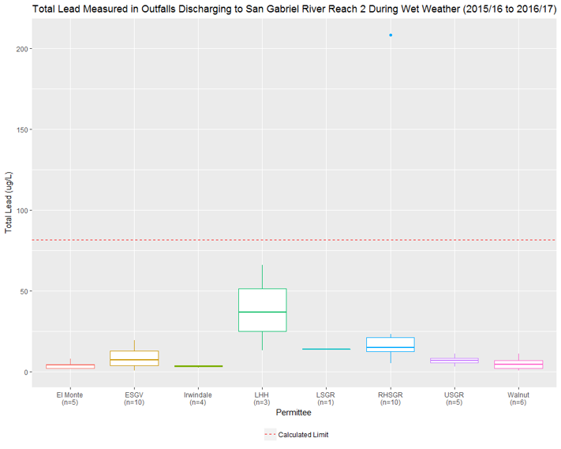

## Facets

- Partition data by a categorical variable into subplots.
- Allows you to see subsets of dataset side-by-side for comparison
- The right facet can highlight and identify key information about a dataset 

## Example 5: Facet by Constituent

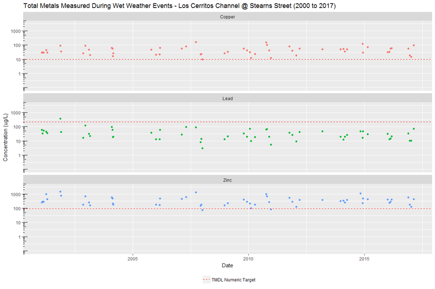

## Example 6: Facet by Weather

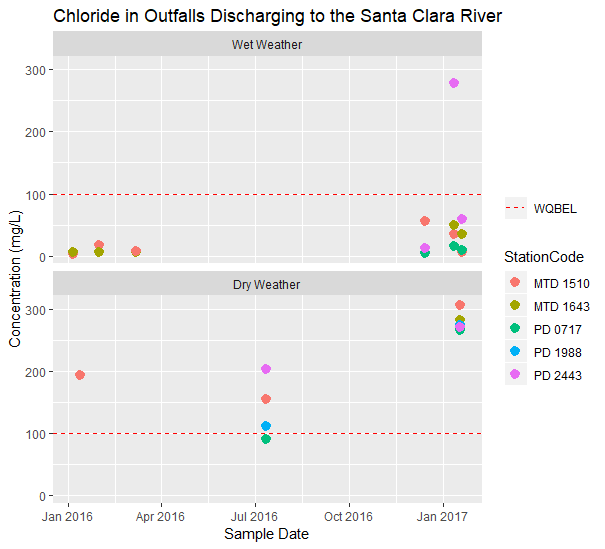

## Example 7: No Facet

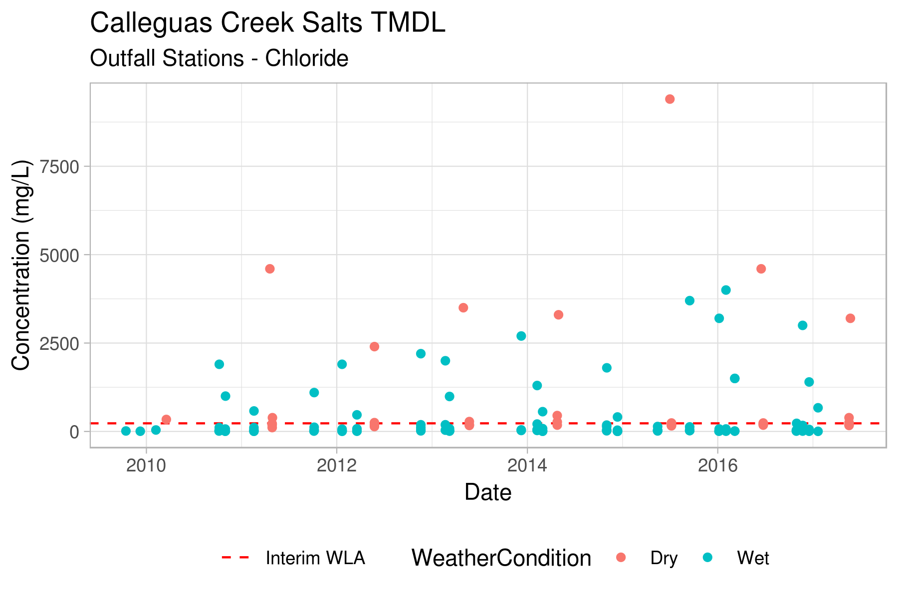

## Example 8: Facet by Station

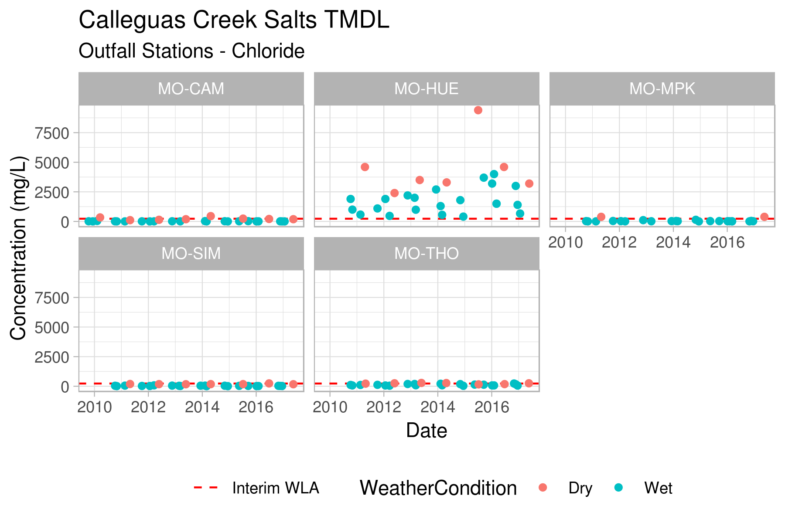

## Example 9: Geofaceting

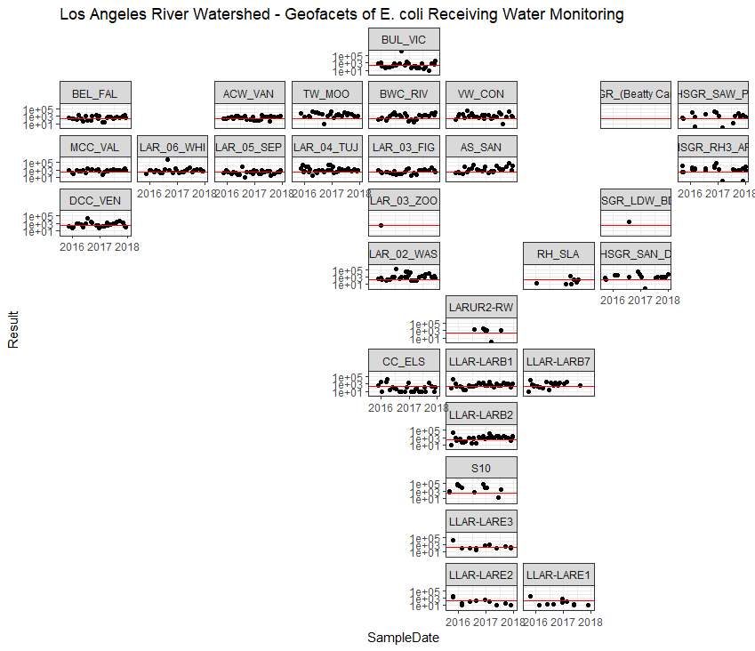

# Interactive Plots

## Example 10: RAA Model Output (Pre vs. Post EWMP)

```{r raa_plot, echo=FALSE, message=FALSE, warning=FALSE}
library(dplyr)
library(lubridate)
library(readxl)
library(ggplot2)
library(plotly)
library(DT)
library(tidyr)
library(ggthemes)

read.file <- "data/example_data.xlsx"
sheets <- excel_sheets(read.file)

data.list <- lapply(sheets, function(x) {
  read_excel(read.file, skip = 25, sheet = x) %>% as.data.frame
})

headers.pre <- c("Subwatershed", "Year", "Month", "Day", "Minute", "Hour", "Blank", 
                 "Prec1", "Prec2", "WetFlag", "Outflow", "TN_tot", "TP_tot", "TCu_tot",
                 "TPb_tot", "TZn_pre", "FColi", "TZn_load")

headers.post <- c("Subwatershed", "Year", "Month", "Day", "Minute", "Hour", "Blank", 
             "Prec1", "Prec2", "WetFlag", "Outflow", "TN_tot", "TP_tot", "TCu_tot",
             "TPb_tot", "TZn_tot", "TZn_post", "FColi", "TZn_load")

names(data.list[[1]]) <- headers.pre
names(data.list[[2]]) <- headers.post
names(data.list[[3]]) <- headers.pre
names(data.list[[4]]) <- headers.post

for (i in seq_along(data.list)) {
  data.list[[i]] <- data.list[[i]] %>% 
    dplyr::mutate(
      Date = lubridate::ymd_hms(paste(Year, Month, Day, Hour, Minute, 0)))
}

SG_pre <- data.list[[1]]
SG_post <- data.list[[2]]

compare <- function(df1, var1, df2, var2){
  df1 <- dplyr::select(df1, Date, Prec2, Outflow, WetFlag, !!as.name(var1))
  df2 <- dplyr::select(df2, Date, !!as.name(var2))
  df <- dplyr::left_join(df1, df2, by = "Date")
}

test <- compare(SG_pre, "TZn_pre", SG_post, "TZn_post") 
test2 <- test %>% dplyr::filter(WetFlag > 0)
test3 <- test2 %>% dplyr::mutate(RainDay = ifelse(Prec2 >= 0.1, "Yes", "No"))

x <- ggplot(test3) +
  geom_point(aes(x = TZn_pre, y = TZn_post, color = RainDay, text = sprintf(
"Flow: %s cfs<br>Precipitation: %s in<br>Date: %s", Outflow, Prec2, Date))) +
  geom_abline(slope = 1, intercept = 0, color = "red") +
  geom_hline(yintercept = 235, color = "blue") +
  ggtitle("San Gabriel River - Comparison of Baseline and Post Implementation") +
  scale_x_continuous("Total Zinc Baseline (ug/L)", 
                     breaks = c(0, 200, 400, 600, 800, 1000)) +
  scale_y_continuous("Total Zinc Post-Implementation (ug/L)", 
                     breaks = c(0, 200, 400, 600, 800, 1000)) 

ggplotly(x)
```


## Example 11: Time Series Graphs

```{r flow_code, echo=TRUE, message=FALSE, warning=FALSE, eval=FALSE}
library(dygraphs)
library(dplyr)
library(readxl)
library(xts)

f319 <- read_excel("data/F319.xlsx")

f319 <- f319 %>%
  dplyr::select(Date, Total) %>% 
  as.data.frame()

data <- xts(f319$Total, f319$Date)

dygraph(data, main = "Los Angeles River Flow Gage F319") %>%
  dyAxis("y", label = "Flow (AF/day)") %>%
  dyRangeSelector() 

```

## Example 11: Time Series Graphs

```{r flow_plot, echo=FALSE, message=FALSE, warning=FALSE, eval=TRUE}
library(dygraphs)
library(dplyr)
library(readxl)
library(xts)

f319 <- read_excel("data/F319.xlsx")

f319 <- f319 %>%
  dplyr::select(Date, Total) %>% 
  as.data.frame()

data <- xts(f319$Total, f319$Date)

dygraph(data, main = "Los Angeles River Flow Gage F319") %>%
  dyAxis("y", label = "Flow (AF/day)") %>%
  dyRangeSelector() 

```

## Example 12: Mapping (IGP Example)

1. Use **SMARTS** Storm Water Data File Download menu, download a tab-delimited file text file of "Storm Water Applications - General Information" for Region 4. 
2. Load the file into R and filter for **active IGP** sites.
3. Use Leaflet package to plot sites on map and display specific information on mouseover.

## Example 12: Mapping (IGP Example)

```{r igp_code, echo=TRUE, message=FALSE, eval=FALSE}

library(dplyr)
library(leaflet)
library(htmltools)

# Load File
filename <- "data/smarts_swapps_geninfo_2018-12-09.txt"
rb4 <- read.delim(filename, sep = "\t", stringsAsFactors = FALSE)

# Filter IGP Sites
rb4igp <- rb4 %>% 
  filter(PERMIT_TYPE == "Industrial") %>%
  filter(STATUS == "Active")

# Plot Map Using Leaflet (code for labels omitted due to space)
leaflet(rb4igp) %>% addTiles() %>%
  addCircles(lng = ~FACILITY_SITE_LONGITUDE, lat = ~FACILITY_SITE_LATITUDE,
             opacity = 0.75, label = lapply(labs, HTML))
  
```

## Example 12: Mapping (IGP Example)

```{r igp_output, echo=FALSE, message=FALSE}
library(dplyr)
library(leaflet)
library(htmltools)

filename <- "data/smarts_swapps_geninfo_2018-12-09.txt"

rb4 <- read.delim(filename, sep = "\t", stringsAsFactors = FALSE)

rb4igp <- rb4 %>%
  filter(PERMIT_TYPE == "Industrial") %>%
  filter(STATUS == "Active")

labs <- lapply(seq(nrow(rb4igp)), function(i) {
  paste0( '<b>', rb4igp[i, "OWNER_OPERATOR_NAME"], '</b></br>', 
          rb4igp[i, "FACILITY_SITE_NAME"], '</br>', 
          rb4igp[i, "FACILITY_SITE_ADDRESS"], '</br>', 
          rb4igp[i, "FACILITY_SITE_CITY"], ', ', 
          rb4igp[i, "FACILITY_SITE_STATE"], ' ', 
          rb4igp[i, "FACILITY_SITE_ZIP"]) 
})

leaflet(rb4igp) %>% 
  addTiles() %>%
  addCircles(lng = ~FACILITY_SITE_LONGITUDE, lat = ~FACILITY_SITE_LATITUDE,
             opacity = 0.75, label = lapply(labs, HTML))
  
```

## Example 13: Mapping Monitoring Data
### R Shiny Web App
<a href="https://ms4dataviewer.shinyapps.io/shinyappsio/">Link</a>

# Other Examples

## Example 14: Scraping Tables from PDFs

- **File**: PDF Report on Trash Assessments in San Mateo County, CA
- **Objective**: Want to get data from tables within the document for data analysis, graphs, Excel, etc.

## Example 14: Scraping Tables from PDFs

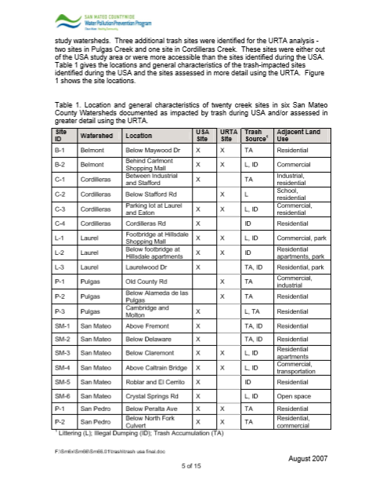

## Example 14: Scraping Tables from PDFs


## Example 14: Scraping Tables from PDFs

```{r scrape_code, echo=TRUE, message=FALSE, eval=FALSE}
library(tabulizer)

report <- "pdf/San Mateo trash RTAs 2006-07.pdf"
lst <- extract_tables(report, encoding="UTF-8")

```

## Example 14: Scraping Tables from PDFs


## Example 14: Scraping Tables from PDFs


## Example 15: Timelines

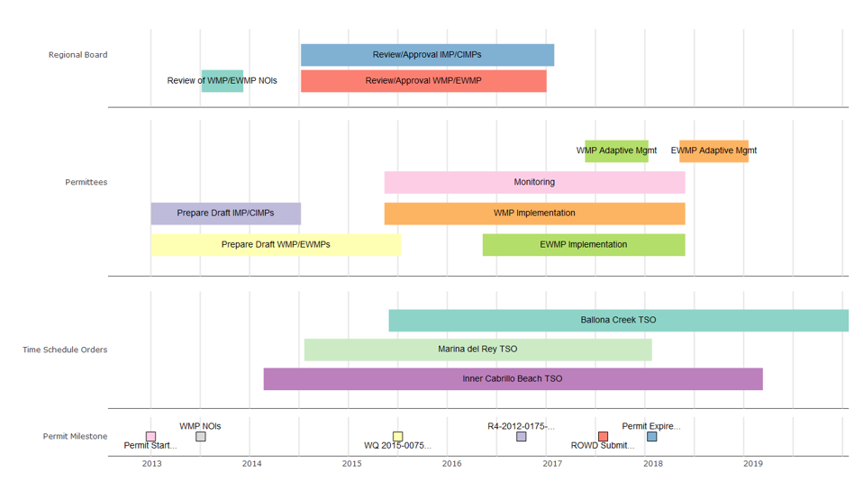

## Example 16: Network Graphs (Permittees - TMDLs)

```{r network, echo=FALSE, message=FALSE, warning=FALSE, eval=TRUE}
library(dplyr)
library(networkD3)
library(readxl)

ptmdl <- read_excel("data/Permittees-TMDL Query.xlsx")

wmps <- read_excel("data/WMP Members Query.xlsx")

ptmdl <- ptmdl %>%
  dplyr::select(Permittee_Name, TMDL_Name)

wmps <- wmps %>%
  dplyr::select(Permittee_Name, Group_Name)

names(ptmdl) <- c("src", "target")
names(wmps) <- c("src", "target")

networkData <- dplyr::bind_rows(ptmdl, wmps)

simpleNetwork(ptmdl, fontSize = 16)
```

## Example 17: Network Graphs (Permittees - WMPs/EWMPs)

```{r network2, echo=FALSE, message=FALSE, warning=FALSE, eval=TRUE}
simpleNetwork(wmps, fontSize = 16)
```

## Statistics
- R was developed and is maintained by statisticians
- Several built-in statistical functions
- Wide selection of add-on statistical packages see: https://cran.r-project.org/web/views/ 

## Data Science
- R is a popular language for "data science"
- Several packages for cleaning, wrangling, and "tidying" data
- Several machine learning and deep learning packages

## Example 18: Webpages
- RMarkdown is a format that can be used to author webpages and other types of documents
- Allows R code to be used when authoring webpages
- See knitr, rmarkdown, bookdown, blogdown packages
- <a href="other/testpage.html">Example</a>

## Example 19: Presentations

This is an R Markdown presentation. Markdown is a simple formatting syntax for authoring HTML, PDF, and MS Word documents. For more details on using R Markdown see <http://rmarkdown.rstudio.com>.

## RStudio

- Free and Open-Source "Integrated Development Environment (IDE)" for R
- Highly, highly recommended if you want to use <footnote content="Chris is not affiliated with RStudio nor receives any incentives for recommending RStudio">R!!!


## What does R / RStudio look like?

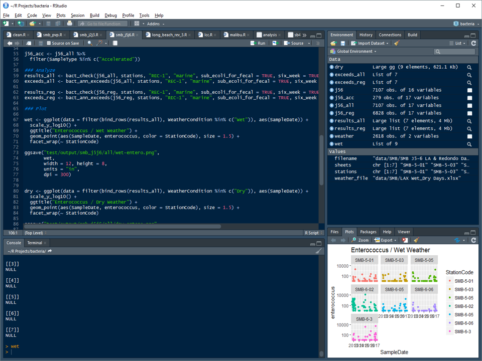

## What does R / RStudio look like?

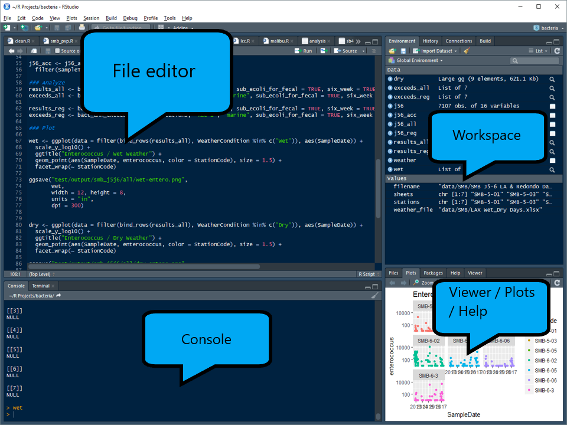

## Strengths
- Repeatable
- Transparent
- Automation
- Packages 
- (Much of these advantages apply to other programming languages like Python as well)

## Weaknesses
- Learning Curve
- Roadblocks 
- Easy to get sidetracked
- Need to be able to focus to code

## Final Thoughts
- R and its packages are just another set of tools (it does not generate insight)
- ~80% of my time working with data is spent cleaning data
- R can help as a tool to communicate information, build analyses, and handle large datasets
- R is a gateway to learning about other technologies and topics (HTML/CSS/Javascript, Git and GitHub, Statistics, Data Science, Visualizations)
- Can change the way you see data

## End

Chris Lopez </br>
Los Angeles Water Board </br>
Stormwater Permitting Unit </br>
chris.lopez@waterboards.ca.gov </br>
https://github.com/chrislopez28 </br>

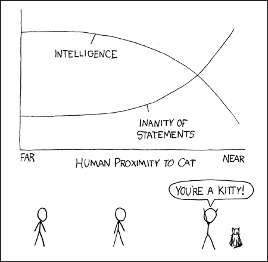
(Credit: xkcd.com)
